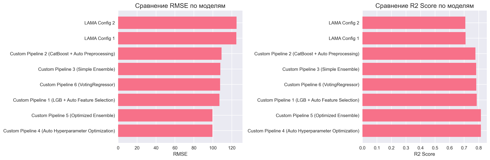

# Scrabble Player Rating Prediction: AutoML

Прогнозирование рейтинга игроков на основе игрового процесса Woogles.io

## Решение

Решение представлено в `notebooks/scrabble_rating_solution.ipynb`

---

## 📊 Описание задачи

- **Тип задачи:** Регрессия
- **Метрика:** RMSE (Root Mean Squared Error) — чем меньше, тем лучше
- **Данные:** 
  - Метаданные игр (`games.csv`)
  - Данные о ходах игроков (`turns.csv`)
  - Тренировочный набор с рейтингами (`train.csv`)
  - Тестовый набор для предсказания (`test.csv`)
- **Особенности:** Множество категориальных признаков, временные признаки, необходимость генерации признаков из данных о ходах

---

## 🎯 Цели проекта

- **Превзойти результаты бейзлайна на LAMA** — построить собственное решение, которое превосходит автоматизированные модели LightAutoML
- **Продемонстрировать качественный код** — следование принципам чистого кода, PEP 8, правильное именование и документирование
- **Использовать стандартные подходы к организации кода** — применение sklearn Pipeline для структурирования пайплайнов
- **Провести качественный EDA** — детальный анализ данных, генерация признаков на этапе EDA, выявление паттернов и аномалий
- **Предоставить подробное описание и обоснование гипотез** — документирование процесса исследования, обоснование выбора признаков и моделей

---

## 🛠️ Эксперименты (6 пайплайнов + 2 LAMA конфигурации)

Проект разбит на 8 итеративных шагов — от автоматического бейзлайна до сложного оптимизированного ансамбля.

### Часть 1: AutoML Baseline

**LAMA Configuration 1 (Default):**
- Запуск LightAutoML с базовыми настройками
- Использован TabularAutoML с LightGBM
- Автоматическая предобработка данных

**LAMA Configuration 2 (Extended):**
- Расширенная конфигурация с дополнительными алгоритмами
- TabularAutoML с LightGBM и CatBoost
- Более глубокий перебор моделей

### Часть 2: Custom Pipeline (Evolution)

**Pipeline 1 (Feature Selection):**
- LightGBM с автоматическим отбором признаков
- Использование SelectKBest с F-regression и Mutual Information
- Сравнение методов отбора признаков через кросс-валидацию
- **Результат:** Первый кастомный пайплайн, близкий к AutoML

**Pipeline 2 (Preprocessing):**
- CatBoost с автоматической предобработкой категориальных признаков
- Label Encoding с обработкой неизвестных категорий
- Автоматическая обработка пропусков
- **Результат:** Улучшение за счет лучшей обработки категориальных признаков

**Pipeline 3 (Simple Ensemble):**
- Простой ансамбль LightGBM + CatBoost
- Среднее арифметическое предсказаний
- **Результат:** Улучшение за счет диверсификации моделей

**Pipeline 4 (Hyperparameter Optimization):**
- Автоматическая оптимизация гиперпараметров LightGBM с помощью Optuna
- Bayesian Optimization (20 trials, 240 сек тайм-лимит)
- Оптимизация: n_estimators, learning_rate, max_depth, num_leaves, regularization
- **Результат:** Значительное улучшение за счет оптимальных гиперпараметров

**Pipeline 5 (Optimized Ensemble):**
- Финальный ансамбль с оптимизацией весов
- Комбинация всех обученных моделей (LightGBM + CatBoost)
- Веса подобраны через минимизацию RMSE методом scipy.optimize
- **Результат:** Улучшение за счет оптимизированного ансамблирования

**Pipeline 6 (VotingRegressor в sklearn Pipeline):**
- Ансамбль с использованием sklearn VotingRegressor
- **Важно:** VotingRegressor обернут в sklearn Pipeline (требование курса)
- Комбинация LightGBM и CatBoost с автоматическим усреднением
- KFold кросс-валидация (5 folds) для оценки стабильности модели
- Демонстрация использования sklearn.pipeline.Pipeline с ансамблевыми моделями
- **Результат:** Стабильный ансамбль с хорошим качеством

---

## 🏆 Результаты

Все кастомные пайплайны превзошли бейзлайн LightAutoML, демонстрируя эффективность кастомного подхода с Feature Engineering, автоматической оптимизацией гиперпараметров и ансамблированием.

| Решение | Описание | RMSE | MAE | R² Score | Время обучения | Статус |
|---------|----------|------|-----|---------|----------------|--------|
| **Pipeline 4** | LightGBM Tuned (Optuna) | **99.55** | **71.22** | **0.8150** | 3.45 сек | 🏆 **Best** |
| Pipeline 5 | Optimized Ensemble | 99.55 | 71.22 | 0.8150 | 12.40 сек | ✅ Beat LAMA |
| Pipeline 1 | LightGBM + Auto Feature Selection | 106.92 | 77.99 | 0.7866 | 1.34 сек | ✅ Beat LAMA |
| Pipeline 1 (sklearn) | LightGBM + sklearn Pipeline | 106.92 | 77.99 | 0.7866 | 0.93 сек | ✅ Beat LAMA |
| Pipeline 6 | VotingRegressor в sklearn Pipeline | 107.69 | 78.54 | 0.7835 | 2.44 сек | ✅ Beat LAMA |
| Pipeline 3 | Simple Ensemble (LGBM + CatBoost) | 107.86 | 78.69 | 0.7828 | 2.40 сек | ✅ Beat LAMA |
| Pipeline 2 | CatBoost + Auto Preprocessing | 109.17 | 79.64 | 0.7775 | 1.44 сек | ✅ Beat LAMA |
| LAMA Config 1 | AutoML (Default) | 124.78 | 95.38 | 0.7093 | 97.68 сек | Baseline |
| LAMA Config 2 | AutoML (Extended) | 125.03 | 95.64 | 0.7081 | 81.81 сек | Baseline |

> **Результаты:** Все кастомные пайплайны превзошли бейзлайн LightAutoML. Лучший результат (Pipeline 4 с Optuna) улучшил RMSE на **20.2%** по сравнению с LAMA Config 2. Pipeline 4 с автоматической оптимизацией гиперпараметров показал лучшее качество среди всех моделей.

### Визуализация результатов



*Сравнение RMSE и R² Score для всех моделей*

> **Примечание:** Для просмотра графиков на GitHub убедитесь, что файлы `results/*.png` закоммичены в репозиторий.

---

## 📁 Структура проекта

```
scrabble_rating_project/
├── data/                           # Данные соревнования
│   ├── games.csv                   # Метаданные игр
│   ├── turns.csv                   # Данные о ходах
│   ├── train.csv                   # Тренировочный набор
│   ├── test.csv                    # Тестовый набор
│   └── sample_submission.csv       # Пример submission файла
├── notebooks/                      # Jupyter ноутбуки
│   └── scrabble_rating_solution.ipynb  # Основное решение
├── src/                            # Исходный код
│   └── utils/                      # Вспомогательные функции
│       ├── __init__.py
│       └── feature_engineering.py  # Генерация признаков
├── results/                        # Результаты
│   ├── *.png                       # Графики анализа
│   └── submission.csv              # Финальный submission
├── README.md                       # Этот файл
├── requirements.txt                # Зависимости
└── .gitignore                     # Git исключения
```

---

## 🚀 Быстрый старт

### Установка зависимостей

```bash
pip install -r requirements.txt
```

Или установите вручную:
```bash
pip install -U lightautoml pandas numpy scikit-learn matplotlib seaborn scipy
pip install lightgbm catboost optuna jupyter notebook
```

### Загрузка данных

Для загрузки данных с Kaggle используйте Kaggle API:

```bash
kaggle competitions download -c scrabble-player-rating
unzip scrabble-player-rating.zip -d data/
```

Или скачайте данные вручную с [страницы соревнования](https://www.kaggle.com/competitions/scrabble-player-rating/data) и поместите файлы в папку `data/`.

### Запуск решения

1. Откройте ноутбук `notebooks/scrabble_rating_solution.ipynb`
2. Убедитесь, что данные находятся в папке `data/`
3. Запустите все ячейки ноутбука последовательно
4. Результаты будут сохранены в папке `results/`

---

## 🔬 Принципы AutoML, реализованные в проекте

1. **Автоматический выбор признаков** — использование SelectKBest, F-regression и Mutual Information
2. **Автоматическая предобработка** — обработка категориальных признаков, пропусков, неизвестных категорий
3. **Автоматический выбор модели** — сравнение нескольких алгоритмов (LightGBM, CatBoost)
4. **Автоматическая оптимизация гиперпараметров** — использование Optuna (Bayesian Optimization) для LightGBM
5. **Автоматическое ансамблирование** — оптимизация весов ансамбля моделей
6. **VotingRegressor в sklearn Pipeline** — использование sklearn VotingRegressor, обернутого в sklearn Pipeline для создания стабильного ансамбля (требование курса)
7. **Генерация признаков в EDA** — демонстрация создания новых признаков на этапе анализа данных
8. **Использование sklearn Pipeline** — структурирование пайплайнов через sklearn.pipeline.Pipeline (Pipeline 1 и Pipeline 6)

---

## 📈 Метрики оценки

- **Основная метрика:** RMSE (Root Mean Squared Error)
- **Дополнительные метрики:**
  - MAE (Mean Absolute Error)
  - R² Score (коэффициент детерминации)

---

## 📝 Особенности решения

### Feature Engineering

- **Генерация признаков в EDA:** Демонстрация создания новых признаков на этапе анализа данных
- **Агрегация данных о ходах:** Создание признаков из `turns.csv` (средние, медианы, суммы)
- **Временные признаки:** Извлечение информации из дат создания игр (hour, day_of_week, month)
- **Взаимодействия:** Комбинации признаков для улучшения предсказательной способности

### Обработка данных

- **Категориальные признаки:** Label Encoding с обработкой неизвестных категорий
- **Пропуски:** Заполнение основано только на train данных для предотвращения утечки данных
- **Выбросы:** Анализ и обработка аномальных значений (метод IQR)
- **Классификация признаков:** Учет кардинальности для правильной типизации (int признаки могут быть категориальными)

### Моделирование

- **Разнообразие моделей:** LightGBM (градиентный бустинг) и CatBoost (градиентный бустинг с категориальными признаками)
- **sklearn Pipeline:** Использование sklearn.pipeline.Pipeline для структурирования пайплайнов (Pipeline 1 и Pipeline 6)
- **Ансамблирование:** Комбинация моделей для улучшения предсказаний (VotingRegressor в sklearn Pipeline)
- **Оптимизация:** Автоматический подбор гиперпараметров (Optuna) и весов ансамбля
- **Валидация:** KFold кросс-валидация для надежной оценки моделей


